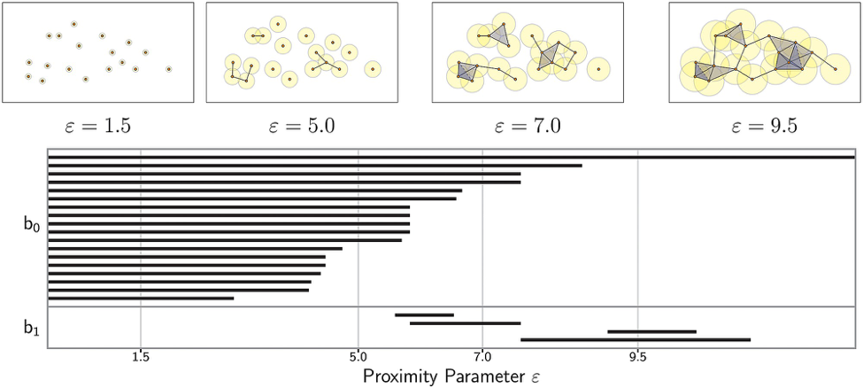
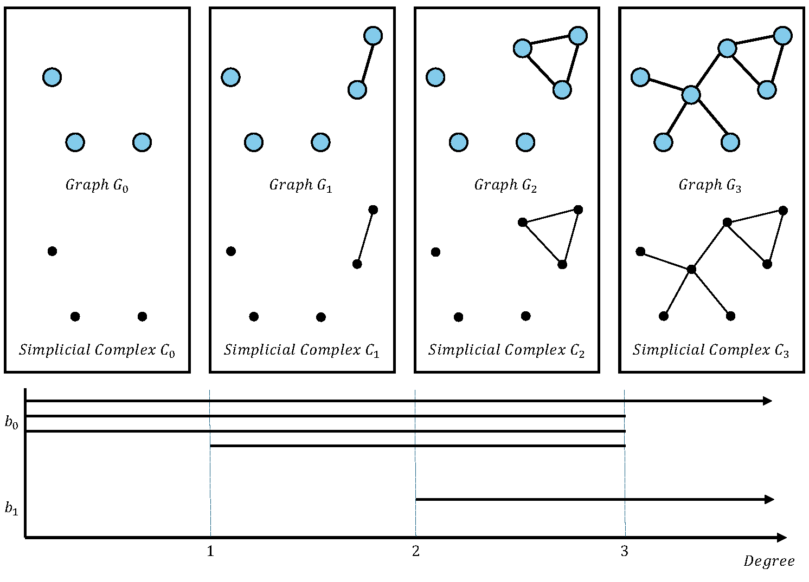
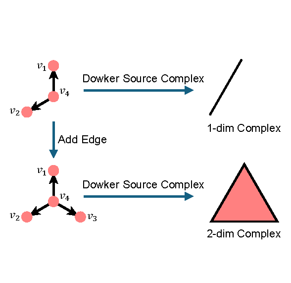
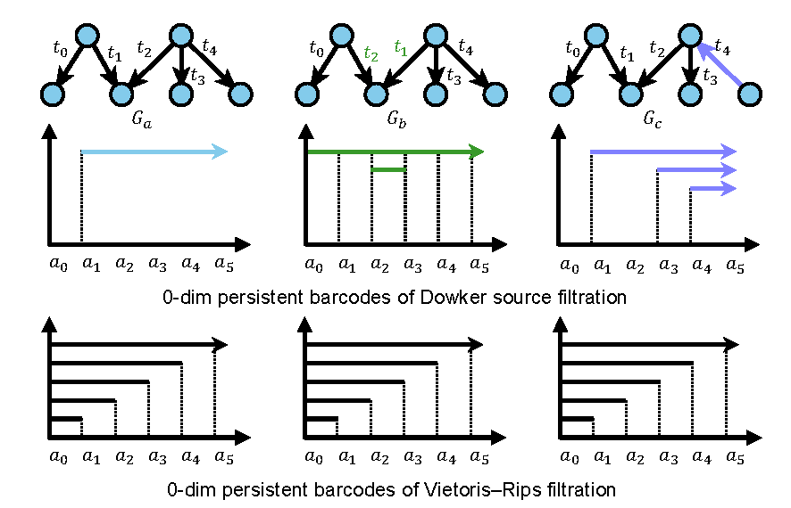
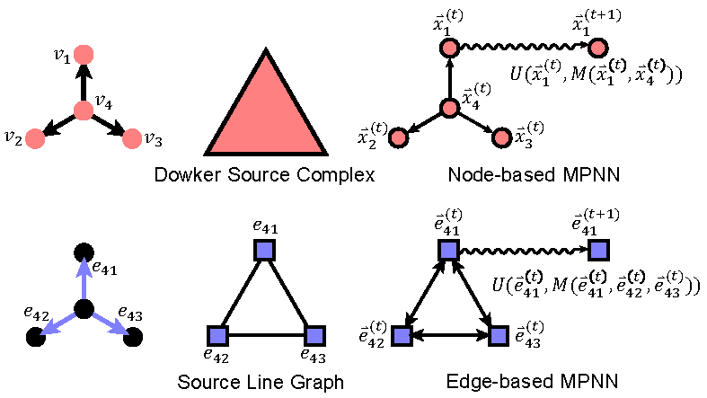

# Background

In this document, we delve deeper into the background of persistent homology [1], discussing the challenges and our innovative solutions for integrating persistent homology with graph neural networks on dynamic directed graphs.

## Persistent Homology

**Topological Data Analysis** (TDA) is a compelling field of mathematics that utilizes topology to extract underlying structures within datasets. At its core, TDA posits that data can often be interpreted as shapes, and these shapes can unveil critical insights into the nature of the data. Within TDA, the concept of **topological invariants** plays a pivotal role. These are properties of shapes that remain unchanged under continuous deformations, such as stretching or bending, but not tearing or gluing.

**Homology** stands out as one of the primary topological invariants in TDA, offering a means to quantify and classify holes within a space across different dimensions. A 0-dimensional hole signifies a gap between components, a 1-dimensional hole resembles a loop, and a 2-dimensional hole reflects the void within a hollow sphere, and so forth.

**Persistent Homology**, a cornerstone of TDA, extends this framework by not merely examining the static structure of data but observing its evolution. Consider a graph, a constellation of points connected by edges, symbolizing the data. Persistent Homology does not focus solely on the graph's final form; instead, it scrutinizes its development. Beginning with isolated points, connections form progressively, uniting pairs of points based on criteria like distance or similarity. This formation sequence, or "filtration," enables the tracking of the emergence and dissolution of holes over time.

The brilliance of Persistent Homology lies in its capacity to capture the fleeting and enduring features of the data across scales. This analysis is visualized through **persistence diagrams** or barcodes, which chart the lifecycle of each hole throughout the filtration process, offering profound insights into the topology of the data.

The introduction of **Simplicial Complexes** into this discourse emphasizes the geometric and topological foundation of TDA and Persistent Homology. Simplicial complexes are built from vertices (0-simplices), edges (1-simplices), triangles (2-simplices), and their higher-dimensional counterparts, providing a structured way to construct and study the topology of spaces formed by data points. Starting as 0-simplices (points), the data's evolving relationships are expanded into higher-dimensional simplicial complexes (edges, triangles, etc.), through the filtration process. Observing the formation and disappearance of these simplicial complexes over varying thresholds enables the tracking of structural evolution within the data and identifies enduring topological features.

Persistent Homology's outcomes, typically represented through persistence diagrams or barcodes, chronicle the birth and demise of "holes" within simplicial complexes across time. This methodology reveals the intrinsic structure of the data, aiding in the comprehension of its fundamental organization and spatial relations, such as clusters, voids, and connectivity.

We provide a more intuitive example, as shown in Figure 1, where we calculate persistent homology on a point cloud in two-dimensional space. In this example, the filtration value $\epsilon$ is designed as the maximum distance between points. When $\epsilon$ is small, no point distances are less than $\epsilon$, and the corresponding simplicial complex consists of independent 0-dimensional simplices (vertices). As $\epsilon$ increases, some 0-dimensional simplices disappear, merging into 1-dimensional simplices(edges), and progressively, more low-dimensional simplices disappear while higher-dimensional simplices increase. 

The graph-like structure induced by point cloud data, composed of simplices, is referred to as a simplicial complex (in this case, the Vietoris-Rips Complex). The persistence diagram below illustrates the results of calculating the homology groups and Betti numbers of the simplicial complex at different filtration values, where $b_0$ represents the 0-dimensional information and $b_1$ the 1-dimensional information of the simplicial complex.

Figure 1. Example of persistent homology

We see that the different filter function and the construction of simplicial complexes represent different interpretations of data's topological structure. The simplicial complex constructed in Figure 1 illustrates the complex multivariate distance relationships among points in a point cloud. 

## Persistent Homology on Graphs

### **Persistent Homology on Static Undirected Graphs**

On static graphs, most methods define filtration on nodes and use this to construct a Vietoris-Rips Complex for calculating persistent homology [2,3,4,5,6,7,8,9,10,11]. As shown in Figure 2, we use node degree as a filter function to generate the corresponding simplicial complex. This demonstrates how the VP complex correlates with the original graph's shape (**even though they are not the same concept**). Thus, many approaches do not overly emphasize the distinction between the original graph and the simplicial complex.

Figure 2. Example of VP complex of graphs

### **Persistent Homology on Dynamic Directed Graphs**

The similarity between the VP complex and the original graph on static undirected graphs greatly facilitates persistent homology analysis.However, simplicial complexes fundamentally represent topological shapes and lack the weighted and directed properties of graphs (more intuitively, simplicial complexes consist only of "lines" and do not incorporate the concept of weighted, directed edges). Hence, it is necessary to employ Dowker complexes, which are specifically designed for directed, weighted graphs.

Figure 3 illustrates the construction process of a Dowker source complex in a simple structure. Intuitively, a Dowker source complex captures the directed structures within a network; for example, if two nodes ($v_1, v_2$) share a common source node ($v_4$), they can form a one-dimensional complex. Conversely, in a Dowker sink complex, if two nodes share the same target node, they can also form a one-dimensional complex. Therefore, the "lines" in Dowker complexes and the edges in graphs represent fundamentally different concepts and forms.

Figure 3. Example of Dowker source complex of graphs

This approach effectively captures the directed relationships within networks. Using a time-related filtration value, we can accurately characterize the features of dynamic weighted graphs. Figure 4 uses a toy example to demonstrate the sensitivity of Dowker complexes to time information and edge direction, which are aspects that VP complexes cannot capture. This is because from the perspective of static undirected graphs, $G_a, G_b, G_c$ appear as identical graphs.

Figure 4. Illustration of Dowker filtration sensitive to timestamp and directions in graphs

## Integrating Persistent Homology with Neural Networks

### **Challenges**

From the discussion about static undirected graphs and VP complexes, it is clear that graph neural networks based on neighborhood aggregation methods align well with VP complexes due to two main reasons:
* Filter values defined on nodes can be seamlessly integrated into the network's node features.
* The structural form of VP complexes mirrors that of the original graph, allowing graph neural networks trained on the original graph to effectively learn the properties of VP complexes.

However, when discussing the integration of dynamic directed graphs with neural networks, these advantages present significant challenges:

* The temporal information and edge connections in dynamic graphs cannot be straightforwardly integrated into node features.
* The form of Dowker complexes is entirely different from that of the original graph, which prevents direct learning of Dowker complex properties from the original graph.

These issues significantly hinder the combination of persistent homology and neural networks on dynamic graphs. To address these challenges, we have developed an innovative line graph transformation module.

### **Innovations of DNDN [AQ1]**

Revisiting Figure 3, we observe that the form of Dowker complexes can also be interpreted as the relationship between two directed edges, $(v_4, v_1)$ and $(v_4, v_2)$. Inspired by this, we have constructed source line graphs and sink line graphs, analogous to Dowker source and sink complexes. 

In the source line graph, directed edges are treated as nodes, and edges sharing a common source node are connected, with a similar approach for the sink line graph. As illustrated in Figure 5, this line graph construction method is directly related to dynamic Dowker filtration and results in a graph that retains the properties of the original dynamic directed graph while also matching the form of Dowker complexes. Specifically:

Figure 5. An example demonstrating the relationship between the source Dowker complex and the source line graph for a directed graph.

* Properties originally defined on edges are now defined on nodes in the line graph, making them learnable through graph neural networks based on neighborhood aggregation.
* Source and sink line graphs correspond to the forms of Dowker source and sink complexes, respectively, enabling learning on line graphs to capture the properties of Dowker complexes.
* Source and sink line graphs aptly meet the duality requirements of Dowker complexes, a property that may not be preserved if learning occurs only on a single graph.

To our knowledge, this line graph construction approach is novel, providing an essential mathematical tool for future research into integrating persistent homology with neural networks on dynamic directed graphs. This innovation is what we consider the most significant highlight of DNDN.

### **Location of Our Work [AQ2]**

Traditional persistent homology methods generate a **filtration** using a filtration function, **compute** persistence diagrams on the induced sequence of simplicial complexes, and then **vectorize** these diagrams for downstream tasks. The integration of persistent homology with neural networks also focuses on these three areas, as introduced in our related work section. In simpler terms:
- **ML for Filtration** involves using neural networks to learn a filtration function, resulting in a sequence of simplicial complexes.
- **ML for Computation** utilizes neural networks to approximate the computational results of persistent homology.
- **ML for Vectorization** transforms persistence diagrams into vectors suitable for downstream tasks.

Among these tasks, **Computation** is the most time-consuming due to the reliance on extensive matrix operations during topological calculations [12], which limits the application of persistent homology to larger-scale dynamic directed graphs. Our research focuses on using neural networks to approximate the computations of dynamic Dowker filtration, laying the groundwork for further studies. We believe this is an appropriate starting point for a series of research initiatives.

## Reference
[1] Dey T K, Wang Y. Computational topology for data analysis[M]. Cambridge University Press, 2022.

[2] Hofer C, Graf F, Rieck B, et al. Graph filtration learning[C]//International Conference on Machine Learning. PMLR, 2020: 4314-4323.

[3] Ye X, Sun F, Xiang S. TREPH: A Plug-In Topological Layer for Graph Neural Networks[J]. Entropy, 2023, 25(2): 331.

[4] Carrière M, Chazal F, Ike Y, et al. Perslay: A neural network layer for persistence diagrams and new graph topological signatures[C]//International Conference on Artificial Intelligence and Statistics. PMLR, 2020: 2786-2796.

[5] Chen Y, Sizikova E, Gel Y R. TopoAttn-Nets: Topological Attention in Graph Representation Learning[C]//Joint European Conference on Machine Learning and Knowledge Discovery in Databases. Cham: Springer International Publishing, 2022: 309-325.

[6] Hofer C, Kwitt R, Niethammer M, et al. Deep learning with topological signatures[J]. Advances in neural information processing systems, 2017, 30.

[7] Zhao Q, Ye Z, Chen C, et al. Persistence enhanced graph neural network[C]//International Conference on Artificial Intelligence and Statistics. PMLR, 2020: 2896-2906.

[8] Chen Y, Coskunuzer B, Gel Y. Topological relational learning on graphs[J]. Advances in neural information processing systems, 2021, 34: 27029-27042.

[9] Yan Z, Ma T, Gao L, et al. Link prediction with persistent homology: An interactive view[C]//International conference on machine learning. PMLR, 2021: 11659-11669.

[10] Horn M, De Brouwer E, Moor M, et al. Topological graph neural networks[J]. arXiv preprint arXiv:2102.07835, 2021.

[11] Immonen J, Souza A, Garg V. Going beyond persistent homology using persistent homology[J]. Advances in Neural Information Processing Systems, 2024, 36.

[12] Yan Z, Ma T, Gao L, et al. Neural approximation of graph topological features[J]. Advances in Neural Information Processing Systems, 2022, 35: 33357-33370.