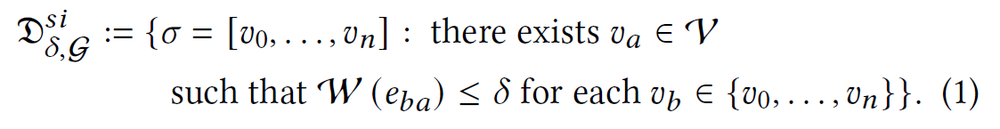
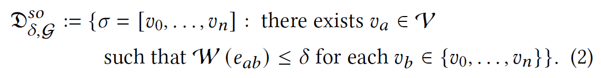
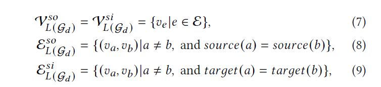
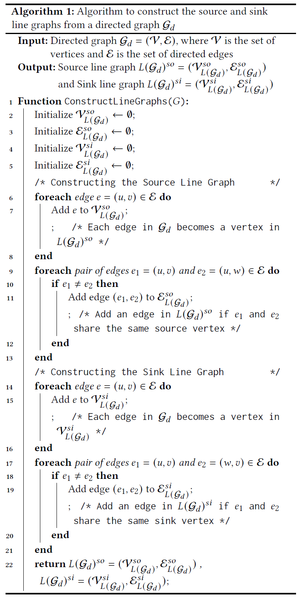
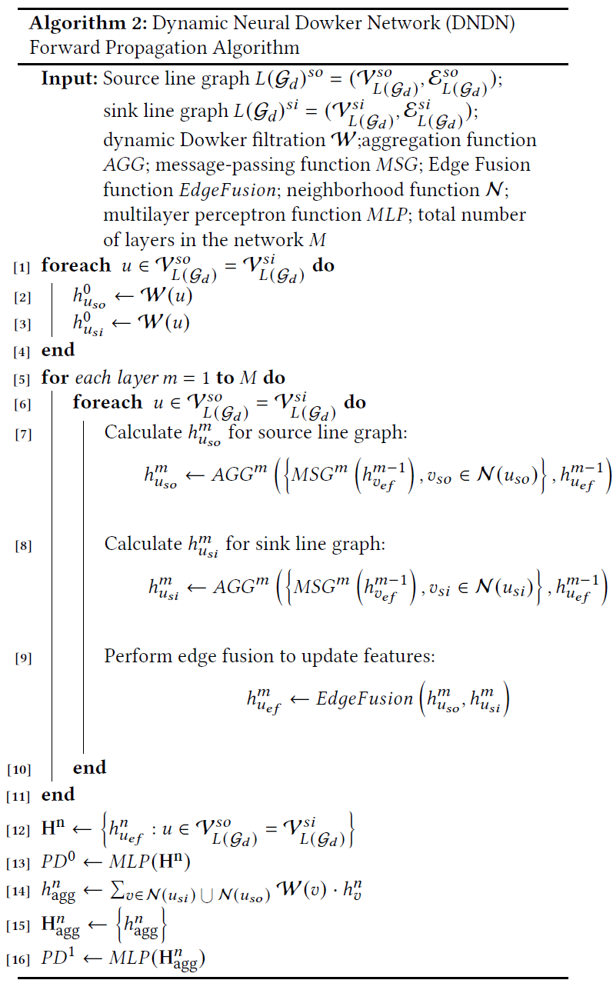

# Revision

In this document, we present the revised Section 3 and the pseudocode for our method. The main modifications are highlighted in bold.

## Section 3 PRELIMINARY AND BACKGROUND

### Persistent Homology

**Persistent homology is a key technique in Topological Data Analysis, which studies the shape and structure of data. The central idea is to analyze datasets by constructing a series of topological spaces and observing the persistence of features across changes in a parameter. When focusing on persistent homology in the context of graphs, the approach typically involves examining how graph-based structures evolve.**

Given a graph $\mathcal{G}=(\mathcal{V}, \mathcal{E})$, where $\mathcal{V}$ is the set of nodes and $\mathcal{E}$ is the set of edges, with $e_{m n} \in \mathcal{E}$ representing an edge between nodes $v_{m}, v_{n} \in \mathcal{V}$. The key step in computing persistent homology involves creating a nested sequence of subgraphs $\mathcal{G}_1 \subseteq \mathcal{G}_2 \subseteq \ldots \subseteq \mathcal{G}_k=\mathcal{G}$ based on a filter function $f$, let $\mathcal{C}_i$ be the simplicial complex induced by $\mathcal{G}_i$. This nested sequence of simplicial complexes $\mathcal{C}_1 \subseteq \mathcal{C}_2 \subseteq \ldots \subseteq \mathcal{C}_k$ is referred to as a filtration of $\mathcal{G}$.

Using the additional information provided by the filtration, we can obtain the persistent homology groups $H$ and their ranks $\beta$. The $\beta_{k}^{i,j}$ captures the topological features of the graph at various dimensions \( k \), such as connected components for $k=0$ and loops for $k=1$, \( i \) and \( j \) represent the birth and death of these topological features. The computed persistent homology can be encoded as a multi-point set in \( R^2 \), known as the persistence diagram (PD), where the $x$ and $y$ coordinates represent the birth and death of topological features, respectively. This approach to analyzing graphs captures their underlying topological characteristics, providing valuable insights into their structure and dynamics beyond what is observable through traditional graph metrics.

### Dowker Filtration

The Dowker Complex is a type of simplicial complex specifically designed for directed graphs. Given a weighted directed graph $\mathcal{G}_d=(\mathcal{V}_d, \mathcal{E}_d, \mathcal{W}_d)$, where $\mathcal{V}_d$ is the set of nodes, $\mathcal{E}_d$ is the set of directed edges, and $e_{m n} \in \mathcal{E}_d$ represents a directed edge from source node $v_{m}$ to target node $v_{n}$, with $\mathcal{W}_d(e_{m n})$ being the weight of the edge $e_{m n}$. The Dowker $\delta$-sink complex is defined as a simplicial complex as follows:

**Where $\sigma$ represents a simplex composed of given nodes. The formula implies that for all nodes $v_b$ in $\sigma$, there exists a directed edge $e_{b a}$ from $v_b$ to $v_a$ with a weight less than or equal to $\delta$. This means that $v_b$ is a source node that meets the filtration criteria. Specifically, the Dowker $\delta$ -sink complex connects nodes $(v_b)$ that share a common target node $(v_a)$, forming a simplicial complex. This linkage is based on the criterion that each $v_b$ is directed towards $v_a$ with an edge weight satisfying the $\delta$ condition.**

Similarly, the Dowker $\delta$ -source complex is symmetrically defined with the roles of source and target reversed:

With increasing $\delta$, we naturally obtain a sequence of Dowker complexes, known as the Dowker $\delta$ -sink filtration or Dowker $\delta$ -source filtration. This filtration process allows for the examination of the evolving topological structure of the graph as the parameter $\delta$ changes, providing insights into the hierarchical and directional properties of the graph.

**Dowker Duality.** For a given directed graph $\mathcal{G}_d$, any threshold value $\delta \in \mathbb{R}$, and dimension $k\geq 0$, the persistent modules induced by the Dowker sink filtration and the Dowker source filtration are isomorphic. This statement reflects a fundamental property of Dowker complexes in topological data analysis. The duality of Dowker complexes necessitates that, in designing neural networks, we must consider both the distinctions and the eventual consistency between source Dowker complexes and sink Dowker complexes.

### Line Graph

Given an undirected graph $\mathcal{G}=(\mathcal{V}, \mathcal{E})$ with $E \neq \emptyset $, the corresponding line graph $L(\mathcal{G})=(\mathcal{V}_{L(\mathcal{G})},\mathcal{E}_{L(\mathcal{G})}) $ is defined as follows:

The threshold $\delta$ in Dowker filtration is defined on the edges, which contrasts with the node-centric approach common in traditional graph neural networks. To address this, our paper extends the concept of line graphs, introducing sink line graphs and source line graphs, corresponding to Dowker complexes. Specifically, given a weighted directed graph $ \mathcal{G}_d=(\mathcal{V},\mathcal{E} )$, its corresponding source line graph $ L(\mathcal{G}_d)^{so}=(\mathcal{V}_{L(\mathcal{G}_d)}^{so}, \mathcal{E}_{L(\mathcal{G}_d)}^{so}) $ and sink line graph $ L(\mathcal{G}_d)^{si}=(\mathcal{V}_{L(\mathcal{G}_d)}^{si}, \mathcal{E}_{L(\mathcal{G}_d)}^{si}) $  are defined as follows:

where $source(a)$ and $target(a)$ respectively refer to the source and target nodes of an edge $a$, $ L(\mathcal{G}_d)^{so} $ and $ L(\mathcal{G}_d)^{si} $, are defined as undirected graphs. **Our method differs from any existing line graph construction, aiming to create graph structures that correspond to dynamic Dowker complexes, thereby facilitating neural network learning.**

## Pseudocode

Algorithm 1: Algorithm to construct the source and sink line graphs from a directed graph $\mathcal{G}_d$

Algorithm 2: Dynamic Neural Dowker Network (DNDN) forward propagation algorithm